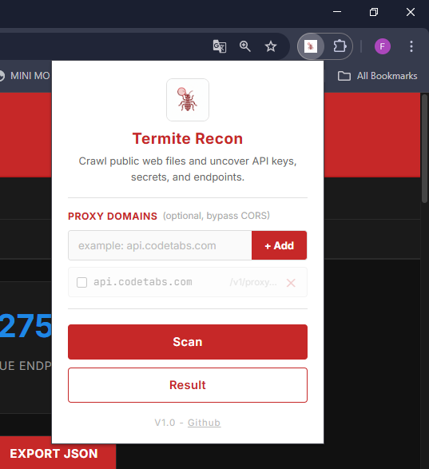
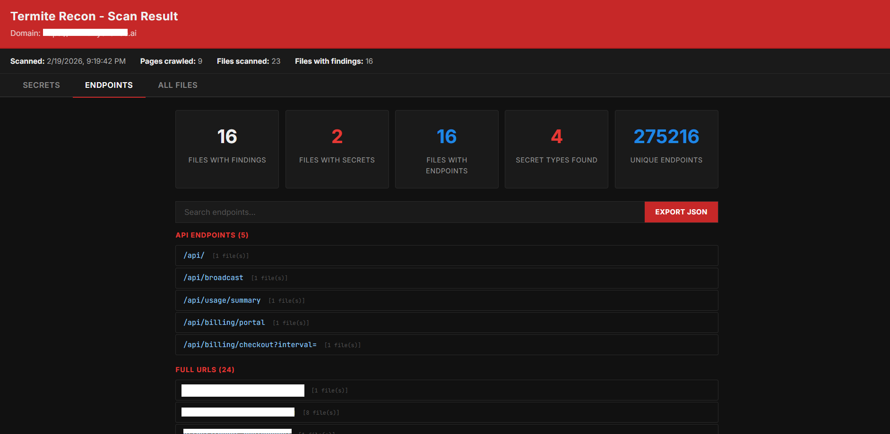

<p align="center">
  
</p>

<h1 align="center">Termite Recon</h1>

<p align="center">
  Crawl public web files and uncover API keys, secrets, and endpoints.
</p>

---

## 📌 What is Termite Recon?

**Termite Recon** is an open-source Chrome Extension designed for security researchers and bug bounty hunters. It automatically scans a target website by crawling its publicly accessible files and looking for sensitive data such as API keys, secrets, credentials, tokens, and exposed endpoints.

> ⚠️ **For Educational & Authorized Use Only.** Always get proper permission before scanning any website.

---

## ✨ Features

- **Multi-format scanning** — JS, TS, JSON, YAML, XML, ENV, BAK, PHP, GraphQL, Terraform, and more
- **Phase 0: Config path probing** — automatically probes 40+ common exposed paths (`/.env`, `/config.json`, `/swagger.json`, `/credentials.json`, etc.)
- **Phase 1: Crawl & discover** — crawls up to 30 pages, reads `sitemap.xml`, collects all scannable file links from `<script>`, `<link>`, and `<a>` tags
- **Phase 2: Deep scan** — dual-layer scan:
  - **Regex-based** — works on any text format
  - **JSON-aware deep scan** — parses JSON structure and walks every key-value pair recursively, detects sensitive key names even without regex match
- **70+ secret pattern detection** — covers AWS, GCP, Azure, Stripe, GitHub, Slack, OpenAI, JWT, and many more (full list below)
- **AWS detection (18 patterns)** — Access Key, Secret Key, Session Token, SES SMTP, S3 Buckets (3 formats), ARN, CloudFront, API Gateway, Cognito (3 types), Lambda URL, SQS, SNS, ECR, RDS, ElastiCache, Elastic Beanstalk, Region, Account ID
- **File type badges** — color-coded badges (JS, JSON, ENV, YAML, XML, BAK, PHP, etc.) per file in results
- **Proxy support** — configurable CORS proxy list with built-in known proxies (CodetTabs, Corsproxy, AllOrigins, etc.)
- **Export results** — export secrets, endpoints, or full findings as JSON
- **Search & filter** — real-time search and filter by type (secrets / endpoints / all files)
- **Sticky header & tabs** — Secrets | Endpoints | All Files view

---

## 🚀 Installation

> Termite Recon is not on the Chrome Web Store. Install it manually as an unpacked extension.

1. **Clone or download** this repository:
   ```bash
   git clone https://github.com/muh-syaipullah/termite-recon.git
   ```

2. Open Chrome and go to:
   ```
   chrome://extensions/
   ```

3. Enable **Developer Mode** (toggle in top-right corner)

4. Click **"Load unpacked"** and select the `chrome-extension` folder

5. The **Termite Recon** icon will appear in your Chrome toolbar ✅

---

## 🧭 How to Use

1. Navigate to the **target website** you want to scan
2. Click the **Termite Recon** icon in the Chrome toolbar
3. *(Optional)* Add a CORS proxy if needed (e.g., `api.codetabs.com`)
4. Click **"Scan"**
5. Wait for the scan to complete (Phase 0 → Phase 1 → Phase 2)
6. Click **"Result"** to view findings in a new tab

---

## 🖼️ Screenshots

The following screenshots illustrate the extension user interface and sample scan results. These images provide a quick overview of how to operate the extension and interpret its output.

<p align="center">
  
  <br>
  <strong>Popup — Configuration & Scan Trigger:</strong> The extension popup used to manage CORS proxies, configure scan options, and start scans quickly.
</p>

<p align="center">
  
  <br>
  <strong>Scan Result — SECRETS Tab:</strong> Listed sensitive findings grouped by type, with search, filtering, and export capabilities for triage and reporting.
</p>

<p align="center">
  
  <br>
  <strong>Scan Result — ENDPOINTS Tab:</strong> Discovered endpoints with source file references and contextual code excerpts to aid investigation.
</p>

---

| Category | Extensions |
|----------|-----------|
| JavaScript | `.js`, `.mjs`, `.jsx` |
| TypeScript | `.ts`, `.tsx` |
| JSON Config | `.json`, `.jsonc` |
| Environment | `.env`, `.env.local`, `.env.prod`, `.env.staging`, `.env.development` |
| YAML | `.yaml`, `.yml` |
| XML | `.xml` |
| Backup Files | `.bak`, `.backup`, `.old`, `.orig`, `.tmp` |
| Server Config | `.php`, `.py`, `.rb`, `.config`, `.conf` |
| Other | `.toml`, `.ini`, `.graphql`, `.gql`, `.tf` |

---

## 🔍 Detected Secret Patterns (70+)

### ☁️ AWS Credentials
| Pattern | Description |
|---------|-------------|
| `AWS Access Key` | `AKIA...` (16 chars) |
| `AWS Secret Key` | Context-aware: `secretAccessKey`, `aws_secret_access_key`, etc. |
| `AWS Session Token` | `ASIA...` temporary credentials |
| `AWS SES SMTP Credentials` | `AKIA...:base64secret` |

### ☁️ AWS Resources & Infrastructure
| Pattern | Description |
|---------|-------------|
| `AWS S3 Bucket (virtual-hosted)` | `bucket.s3.region.amazonaws.com` |
| `AWS S3 Bucket (path-style)` | `s3.amazonaws.com/bucket` |
| `AWS S3 Bucket (s3://)` | `s3://bucket-name/path` |
| `AWS ARN` | `arn:aws:service:region:account:resource` |
| `AWS CloudFront Domain` | `*.cloudfront.net` |
| `AWS API Gateway URL` | `*.execute-api.region.amazonaws.com` |
| `AWS Cognito Identity Pool ID` | `region:uuid` format |
| `AWS Cognito User Pool ID` | `region_XXXXXXXXX` |
| `AWS Cognito App Client ID` | `clientId`, `userPoolClientId` key patterns |
| `AWS Lambda Function URL` | `*.lambda-url.region.on.aws` |
| `AWS SQS Queue URL` | `sqs.region.amazonaws.com/account/queue` |
| `AWS SNS Topic ARN` | `arn:aws:sns:...` |
| `AWS ECR Registry URL` | `account.dkr.ecr.region.amazonaws.com` |
| `AWS RDS Endpoint` | `*.region.rds.amazonaws.com` |
| `AWS ElastiCache Endpoint` | `*.cfg.region.cache.amazonaws.com` |
| `AWS Elastic Beanstalk URL` | `*.region.elasticbeanstalk.com` |
| `AWS Region Hardcoded` | `region: "us-east-1"` patterns |
| `AWS Account ID` | `accountId: "123456789012"` patterns |

### 🔵 Google / Firebase / GCP
| Pattern |
|---------|
| `Google API Key` (`AIza...`) |
| `Google Service Account JSON` (`"type": "service_account"`) |
| `Google OAuth Client Secret` |
| `Firebase Database URL` (`*.firebaseio.com`) |
| `Firebase Key` (`AAAA...`) |

### 🔷 Azure
| Pattern |
|---------|
| `Azure Storage Account Key` |
| `Azure SAS Token` |

### 💳 Payment & SaaS
| Pattern |
|---------|
| `Stripe Secret Key` (`sk_live_...`) |
| `Stripe Test Key` (`sk_test_...`) |
| `Stripe Publishable Key` (`pk_test/live_...`) |
| `PayPal Access Token` |
| `Razorpay API Key` (`rzp_live_...`) |
| `Shopify Private App Token` (`shpat_...`) |
| `Square Access Token` (`sq0atp-...`) |

### 🗄️ Database & Backend
| Pattern |
|---------|
| `MongoDB URI` (`mongodb://` / `mongodb+srv://`) |
| `PostgreSQL URI` (`postgres://` / `postgresql://`) |
| `MySQL URI` (`mysql://`) |
| `SQL Server URI` (`mssql://`) |
| `Redis URI` (`redis://`) |
| `CouchDB URI` |
| `Neo4j URI` (`neo4j+s://`) |
| `Elasticsearch Endpoint` (`:9200`) |

### 💬 Messaging & Communication
| Pattern |
|---------|
| `Slack Bot Token` (`xoxb-...`) |
| `Slack User Token` (`xoxp-...`) |
| `Discord Bot Token` |
| `Telegram Bot Token` |
| `Twilio SID` (`AC...`) |
| `Twilio Auth Token` |
| `SendGrid API Key` (`SG.xxx.xxx`) |
| `Mailgun API Key` (`key-...`) |
| `Postmark API Token` (`PM...`) |

### 🔑 Source Control & CI/CD
| Pattern |
|---------|
| `GitHub PAT` (`ghp_...`) |
| `GitHub OAuth Token` (`gho_...`) |
| `GitHub App Token` (`ghs_...`) |
| `GitLab Personal Access Token` (`glpat-...`) |
| `CircleCI Token` |
| `Travis CI Token` |

### 🔐 Auth & Identity
| Pattern |
|---------|
| `JWT Token` (`eyJ...`) |
| `Supabase JWT` |
| `Bearer Token` |
| `OAuth Client Secret` |
| `Auth0 Client Secret` |
| `SAML Certificate` |
| `Okta API Token` |
| `Private Key` (RSA, EC, DSA, PGP) |

### 🤖 AI & Other Services
| Pattern |
|---------|
| `OpenAI API Key` (`sk-...`) |
| `Supabase Project URL` (`*.supabase.co`) |
| `Supabase API Key` (`sbp_...`) |

### 🔒 Generic Credentials
| Pattern |
|---------|
| `Hardcoded Password` (`password = "..."`) |
| `API Key (generic)` (`api_key = "..."`) |
| `Secret (generic)` (`secret = "..."`) |
| `Token (generic)` (`token = "..."`) |

### 🧬 JSON Deep Scan (Key-Value Analysis)
When the scanned file is valid JSON, the extension **walks every key recursively** and flags values where the key name matches known sensitive patterns such as:

`password`, `passwd`, `secret`, `token`, `api_key`, `apikey`, `access_token`, `refresh_token`, `client_secret`, `private_key`, `db_password`, `connection_string`, `database_url`, `mongodb_uri`, `redis_url`, `github_token`, `stripe_secret`, `openai_api_key`, `aws_access_key_id`, `aws_secret_access_key`, `endpoint`, `base_url`, `api_endpoint`, and 30+ more.

---

## 🌐 Common Probed Paths (Phase 0)

```
/.env                     /config.json              /swagger.json
/.env.local               /settings.json            /openapi.json
/.env.production          /appsettings.json          /openapi.yaml
/.env.staging             /firebase.json            /api-docs
/.env.development         /package.json             /v1/api-docs
/credentials.json         /composer.json            /.travis.yml
/secrets.json             /webpack.config.js        /docker-compose.yml
/database.yml             /next.config.js           /serverless.yml
/database.json            /nuxt.config.js           /cloudformation.json
/config.bak               /swagger.yaml             /terraform.tfvars
/wp-config.php.bak        /.well-known/openid-configuration
... and more
```

---

## ⚙️ Proxy Configuration

Some websites block cross-origin requests. Add a CORS proxy in the popup:

| Proxy | Format |
|-------|--------|
| `api.codetabs.com` | `https://api.codetabs.com/v1/proxy?quest=` |
| `corsproxy.io` | `https://corsproxy.io/?` |
| `api.allorigins.win` | `https://api.allorigins.win/raw?url=` |
| `cors-anywhere.herokuapp.com` | `https://cors-anywhere.herokuapp.com/` |

You can also add your own custom proxy domain.

---

## 🗂️ Project Structure

```
chrome-extension/
├── manifest.json       # Extension manifest (MV3)
├── background.js       # Service worker
├── content.js          # Scanner engine (injected into page)
├── popup.html          # Extension popup UI
├── popup.js            # Popup logic & proxy manager
├── result.html         # Scan result page
├── result.js           # Result renderer
├── icon.png            # Extension icon
├── LICENSE             # MIT License
└── README.md           # This file
```

---

## 🛡️ Disclaimer

This tool is intended for **authorized security testing and educational purposes only**.

- Do **NOT** use this tool on websites without **explicit written permission**
- The author is **not responsible** for any misuse or damage caused by this tool
- Always follow responsible disclosure practices

---

## 📄 License

This project is licensed under the **MIT License** — see the [LICENSE](./LICENSE) file for details.

---

## 👤 Author

**MUH. SYAIPULLAH**
- GitHub: [@muh-syaipullah](https://github.com/muh-syaipullah)

---

*Made with ❤️ for the security community*
